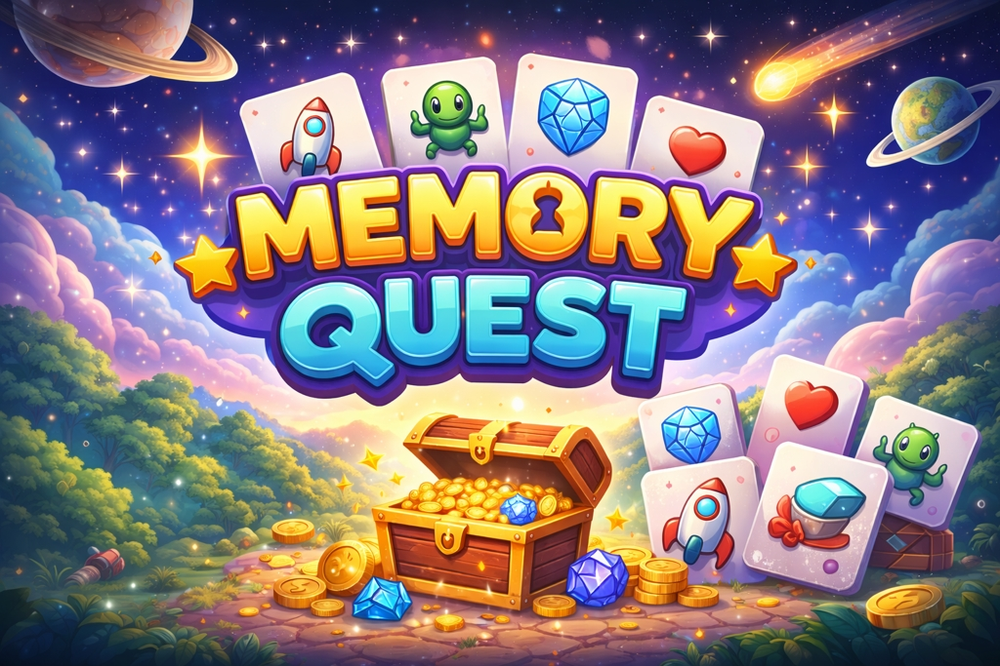

# Memory Quest Elite

## Project Description
**Memory Quest Elite** is a browser-based memory card matching game that challenges players to find pairs of cards. The game features multiple difficulty levels, dynamic day/night themes, achievements, and real-time tracking of score, coins, combos, and hints. It is designed to run smoothly on both desktop and mobile browsers.

## Features
- Multiple difficulty levels: Easy, Medium, Hard  
- Dynamic day/night UI themes  
- Achievements and rewards system  
- Real-time HUD showing score, time, lives, and combo multipliers  
- Points, coins, and hints for enhanced gameplay  
- Responsive design compatible with mobile, tablet, and desktop  
- Smooth CSS animations for cards and UI elements  
- Lightweight and fast with no external dependencies  

## Technologies Used
- **HTML5** – Structure of the game  
- **CSS3** – Styling, responsive design, and animations  
- **JavaScript (vanilla)** – Game logic, scoring, and interactivity  
- **CSS Variables & Flex/Grid** – Layout and theme switching  

## How to Run
1. Clone or download the repository.  
2. Open the `index.html` file in any modern web browser.  
3. The game will load automatically, and you can select a difficulty level to start.  
4. Click or tap on cards to flip them and match pairs.  
5. Use the HUD to monitor your score, coins, hints, and remaining lives.  
6. Optional: open browser console to see debug info if needed.  

## Future Improvements
- Add background music and sound effects  
- Online leaderboards and multiplayer support  
- Additional achievements, unlockable themes, and special cards  
- Progressive Web App (PWA) support for offline play  
- Performance optimizations for low-end devices  